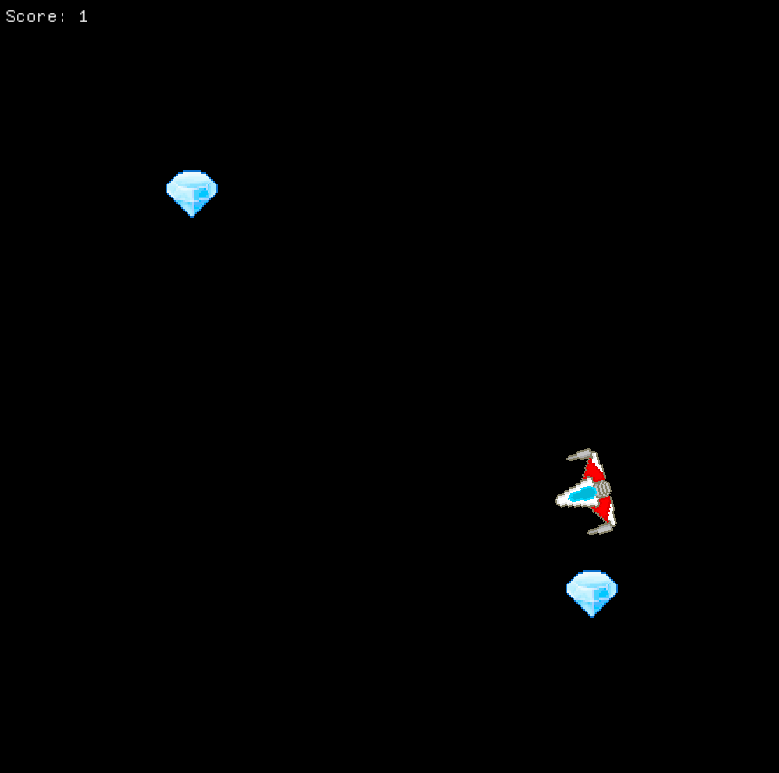

# Agario In Space

Transforms and Multiple Objects. This program is a simple game with a space ship that can be moved around, collecting power-ups and growing larger every time it eats a power-up.

## Keyboard Controls
Use the mouse to rotate the ship around. Use the `W` key to move forward, and the `S` key to move backwards. Collect the diamond shaped pickups to increase your score and grow larger in size. You win the game after all 3 pickups are collected.
Reset anytime by pressing the `R` key.

## Compiler and Platform
- Compiler: Microsoft C++ Compiler (MSVC 2022)
- Platform: Microsoft Windows 10 Pro (64-bit)
